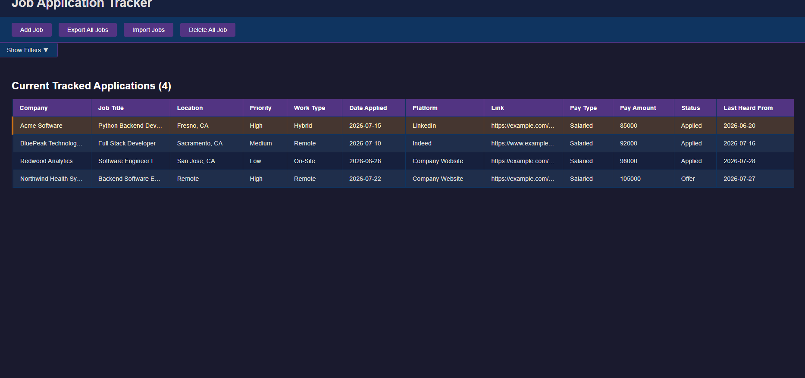
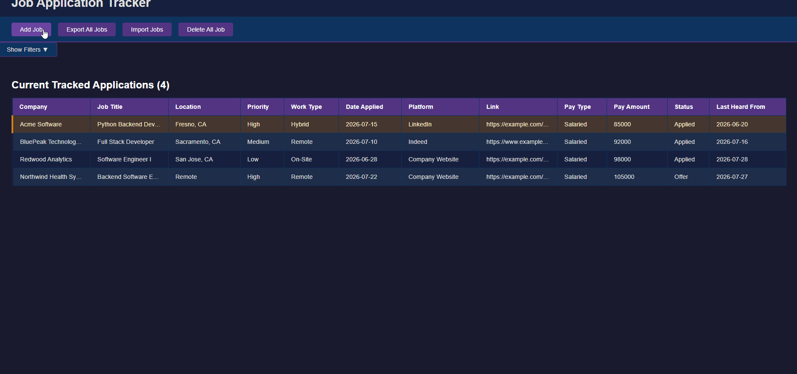
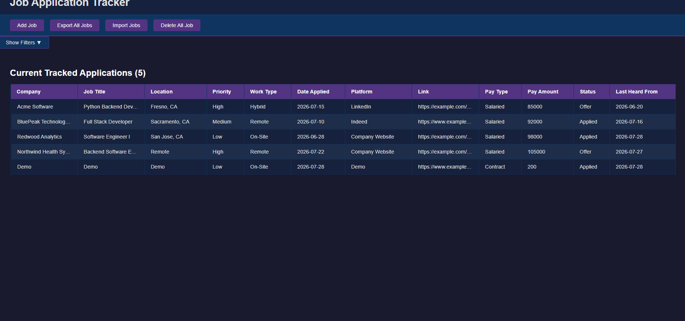

# Job Application Tracker


## Demo 

### Application Overview



### Adding Applications


### Editing Applications



## Keep track of every job application in one place

Having trouble remembering where you last applied? Not anymore. This application helps you track every job you applied to with ease.

This tracker allows you to track the company, role, work type, location, application date, pay type and amount, last heard from, status, link, resume name, and notes. Remove any jobs after a set period without hearing back from them, or consider deleting them.

## Technologies

* Python
* React
* FastAPI
* SQLite
* PyTest
* Vitest
* Render

## Features

* Log job applications with company, role, apply date, pay type, pay amount, link, platform, last heard from, and notes.
* Track application status: Applied, Phone Screen, Interview, Offer, Rejected, Withdrawn
* Applications flagged automatically after 2 weeks of no response
* Track interview rounds per application with custom labels
* Export and import data as JSON
* Application history showing all status changes

## The Process

### Why does this project exist?

This started as a personal need; I was losing track of where I applied to in my active job search. To handle that need, I developed this project.

### Planning

Before writing the code, I planned most of the project in FUNCTIONS.md and RELEASED.md, going over the functions to be implemented, the about of the project, project features, and target audience.

### Building the Core

The project was built in this order: schema planning, database implementation, frontend, backend, testing, and automated testing.

I built three database tables; the first two were planned originally, but the third came as an idea to keep track of users' history log for the final schema. Leading the tables in this SQLite database are the following: job_applications, interview_rounds, and job_application_log.

This was also my first time making a React application, but it went fine with the creation of many components to help users: add, view, edit, update, import, export, and remove their job applications.

A Pydantic model was created to collect data from the frontend, along with an alias generator from snake case to camelCase.

### The CORS Issues

CORS middleware became a hard issue for me when developing both locally and in production. I struggled with environment variable errors, URL mismatch errors, and reordered the application before the tests passed.

I solved it with a basic solution via environment variables, but still had issues testing it until I started using ‘Act’ locally for GitHub Actions testing. My usage of ‘Act’ was using an automation script baked into my pre-push to GitHub: it starts Docker if it isn’t already running, runs the full test suite, and pushes to GitHub only if everything passes.

### Testing

All of these elements were tested: the API routes, utility functions, and database functions for both the happy path, error cases, and missing data.

### Deployment and Data Persistence

Using Render’s free tier, I uploaded both my frontend and backend on separate services: a web service and static site. Environment variables were used to create the link between the two without being hardcoded.

The JAT exporting and importing helped with the free tier's temporary storage limitations on Render, where all database data would be deleted after some time of inactivity. It allowed users to save their data themselves before leaving the site.

### Development Mid Project

The workflow for building these things was to create the user interface, develop the backend, link them, test it, and repeat. All features from adding, editing, exporting, importing, deleting, interview rounds, and logs went through this.

During the development, I learned about the importance of Foreign Key Enforcement and ON CASCADE DELETE  for SQL and implemented both into my code/database.

Of course, some of my tests broke during development, but those were failures in catching CORS issues and using an improper code 204 with content given. Frontend testing was added for the filter features technology, being the only frontend test using Vitest.

With frontend testing now added, I added a test-frontend.yml GitHub Workflow for frontend automated testing.

### Development Closing

Some missing fields were added in the final stages, such as location, work type, status, and priority.

The only feature cut was the settings feature, which was only going to change the frontend’s theme.

Next, the Filter Bar was implemented on the frontend, both visually and functionally, to ensure every filter update happens without a page refresh.

The final touches of the project include the following things:

1. After five seconds, the import message will disappear from the user’s view.
2. Spaces cannot lead to edits for the user.
3. Better Error handling for file imports.
4. Removed a major silent failing issue for when the API deletes all applications.
5. Removing an issue where the frontend asked twice to delete a single application.
6. Adding a missing feature where the rounds were not exported for feature job applications.

Plus the final adjustments to this README.md, which were adding the Vitest badge and Pytest, recounting development, the What I Learned section info, and finally a video on the project walkthrough.

Finally, that wraps everything about building the Job Application Tracker. I did not cover everything in extensive detail since I wanted this part to be digestible for readers.

With that, that is the whole development process / how I built this project.

## What I Learned

During this project, I learned these new things to help me become a better developer and advance in my field:

* HTTP Status Code:
  * In Issue #12, I merged a PR that violated the “No Content” requirement of a 204 response by returning a JSON body alongside it, a mismatch that caused a silent failure. I later fixed it by switching the response to 200 instead.
* Carefully Plan Database Schema Code:
  * My tables used CREATE TABLE IF NOT EXISTS, so adding ON DELETE CASCADE later had no effect on my existing local database. I fixed it by deleting and recreating the database, an easy option locally, but in production, the same oversight could have required a real, carefully planned database migration instead.
* The Importance of Branch Protection:
  * Branch protection caught a real mistake twice. I accidentally pushed directly to main twice during this project, once by running git push -u origin main while on a feature branch, and once through VS Code’s Source Control panel, where I didn’t know how to stop it. Branch protection rejected both pushes before they reached main. 

## Running the Project

### Option 1: Docker (Recommended)

Requirements:
- Docker Desktop

Start the application:
```bash
docker compose up --build
```

### Option 2: Manual

Requirements: 
- Node.js v24.16.0 or higher
- Python 3.13.12 or higher

You need to set up the backend and frontend servers to run the application.

**Backend**:
```bash
cd backend
python -m venv .venv
# Windows command: .venv\Scripts\activate
source .venv/bin/activate
pip install -r requirements.txt
uvicorn main:app --reload
```

**Frontend**:
```bash
cd frontend
npm install
npm run dev
```

Then open http://localhost:5173 in your browser.

## Remote

The application is currently live at:

* Frontend: https://job-application-tracker-front.onrender.com
* Backend API: https://job-application-tracker-mxlz.onrender.com/docs

Note: The Render free-tier hosting may take 30-60 seconds to wake up the backend on the first visit.

## How to Run Tests

The test suite built for this project uses pytest and covers API endpoints, schema validation, and database operations.

To run the tests locally:

### Python
```bash 
cd backend
pip -m venv  .venv
pip install -r requirements.txt
source .venv/bin/activate # Windows: .venv\Scripts\activate
python -m pytest
```

### Javascript
```bash 
cd frontend 
npm install
npm test
```
